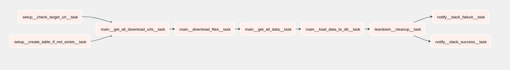

# Refresh giving the geographic adjustment values for MPFS

## Goal

Using [download.cms.gov](https://download.cms.gov/) as Reference Data Sources, refresh CMS GPCI

## Description

The DAG gets all needed archives urls of CMS GPCI data from
[https://www.cms.gov/Medicare/Medicare-Fee-for-Service-Payment/PhysicianFeeSched/PFS-Federal-Regulation-Notices-Items/CMS-1715-F](https://www.cms.gov/Medicare/Medicare-Fee-for-Service-Payment/PhysicianFeeSched/PFS-Federal-Regulation-Notices-Items/CMS-1715-F)
site. Then it downloads these archives, unpacks them, and picks up a needed file with CMS GPCI data inside. Then the
DAG transforms the data to a suitable representation and uploads it to DB if the data isn't there already.

## Short overview

1. Name: `cms_gpci_data_processing`
2. Type: `airflow dag`
3. Owner: `data_team`
4. Schedule Interval: `yearly`

## DAG params
During execution in a normal way all tasks will be getting parameters from `context['param']` object. 
Items in that objects are predefined from airflow Variable model. 
In a case when we would run DAG manually with some changes, tasks will try to fetch parameters from `context['dag_run'].conf`
object. See `dags/common/utils/__init__/get_param`
Structure:
    `<name_in_dag_code>: <name_in_aiflow_variables> | type | default value | description`

```yaml
{
    'root_url': 'root_url', str, 'https://www.cms.gov/Medicare/Medicare-Fee-for-Service-Payment/PhysicianFeeSched/PFS-Federal-Regulation-Notices-Items/CMS-1715-F', root url page
    'local_folder_name': 'local_folder_name', str, 'cms_gpci', url where zip files will be uploaded temporarily
}
```
## DAG connections

All needed connections below:
1. Postgres: connection name - `postgres_t_data`

## Installation

1. Be sure that all packages from `requirements.txt` (in project root folder) are already installed into environment
2. Also be sure that all needed DAG connections also provide via Airflow UI (Admin -> Variables)
3. Set all needed variables for DAG params via Airflow UI (Admin -> Connections)

## Graph


