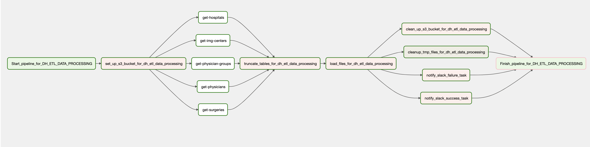

# Refresh Definitive Healthcare data

## Goal

Using [sftp.defhc.com](https://sftp.defhc.com/) as Reference Data Sources, refresh Definitive Healthcare data.
## Description

The DAG gets all needed archives of Definitive Healthcare data from
[SFTP server](https://sftp.defhc.com/). Then it downloads these archives (via SFTP or HTTPS), uploads each archive to the temprorary S3 bucket,
and loads each file of the ZIP archive into predefined output table.
All the data is outputed to the table per CSV in the `definitive_healthcare` schema.

## Short overview

1. Name: `dh_etl_data_processing`
2. Type: `airflow dag`
3. Owner: `data_team`
4. Schedule Interval: at 11 day of each quarter (1,4,7,10) at 00:00

## DAG variables

Variables can be set to change the Connection for SFTP server/PostgreSQL:

1. PostgreSQL - `dh_db_conn_name` (defaults to `postgres_t_data` Connection) - the DB data would be outputted to
2. SFTP - `dh_sftp_server` (defaults to `dh_sftp_server` Connection) - the Input data comes from
3. S3 - `aws_s3_bucket` - The input data is uploaded to

## DAG connections

All needed connections below:

1. Postgres: connection name - `dh_db_conn_name`
2. SFTP: connection name - `dh_sftp_server`

## Installation

1. Also be sure that all needed DAG connections provided via Airflow UI (Admin -> Variables)
2. Set all needed variables for DAG params via Airflow UI (Admin -> Connections)

## PostgreSQL
PostgreSQL output DB has predefined function to truncate all tables in the `definitive_healthcare` schema.
Source code

```sql
CREATE OR REPLACE FUNCTION truncate_dh_tables() RETURNS void AS $$
DECLARE
    statements CURSOR FOR
        SELECT tablename FROM pg_tables
        WHERE schemaname = 'definitive_healthcare';
BEGIN
    FOR stmt IN statements LOOP
        EXECUTE 'TRUNCATE TABLE ' || 'definitive_healthcare.' || quote_ident(stmt.tablename) || ' CASCADE;';
    END LOOP;
END;
$$ LANGUAGE plpgsql;
```

## Graph


