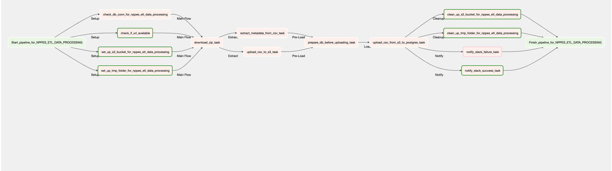

# Refresh NPI information for all US providers

## Goal

Using [download.cms.gov](https://download.cms.gov/) as Reference Data Sources, 
refresh NPI information for all US providers

## Description

A few short sentences about DAG business logic and criteria

## Short overview

1. Name: `nppes_etl_data_processing`
2. Type: `airflow dag`
3. Owner: `data_team`
4. Schedule Interval: `monthly`

## DAG params
During execution in a normal way all tasks will be getting parameters from `context['param']` object. 
Items in that objects are predefined from airflow Variable model. 
In a case when we would run DAG manually with some changes, tasks will try to fetch parameters from `context['dag_run'].conf`
object. See `dags/common/utils/__init__/get_param`
Structure:
    `<name_in_dag_code>: <name_in_aiflow_variables> | type | default value | description`

```yaml
{
    'http_root_url': 'nppes_data_root_url', str, '', root url of web page for searching
    'file_xpath': 'nppes_data_csv_file_xpath', str, '', full xpath to an html element (a tag)
    'regex_pattern': 'npidata_filename_regex', str, '', regex pattert for selecting file from zip
    's3_root_url': 'aws_s3_bucket', str, '', s3 bucket for file processing (airflow must have perms for that)
    'chunk_size': 'chunk_size', int, 1024 * 5, chunk size in bytes
}
```

## DAG connections
Please provide list of all needed connections below: 
1. AWS S3: connection name - `aws_default`
2. Postgres: connection name - ``

## Installation

1. Be sure that all packages from `requirements.txt` (in project root folder) are already installed into environment
2. Also be sure that all needed DAG connections also provide via Airflow UI (Admin -> Variables)
3. Set all needed variables for DAG params via Airflow UI (Admin -> Connections)

## Graph


